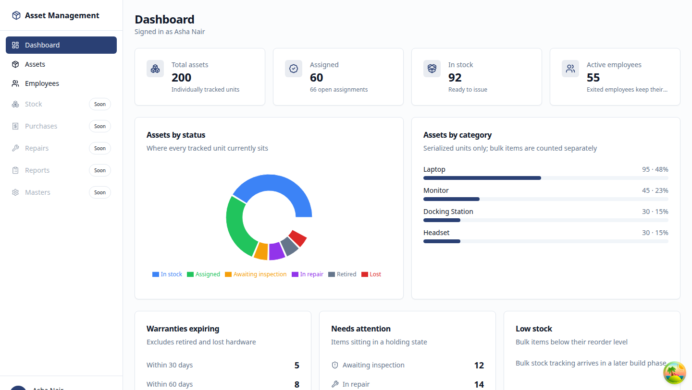
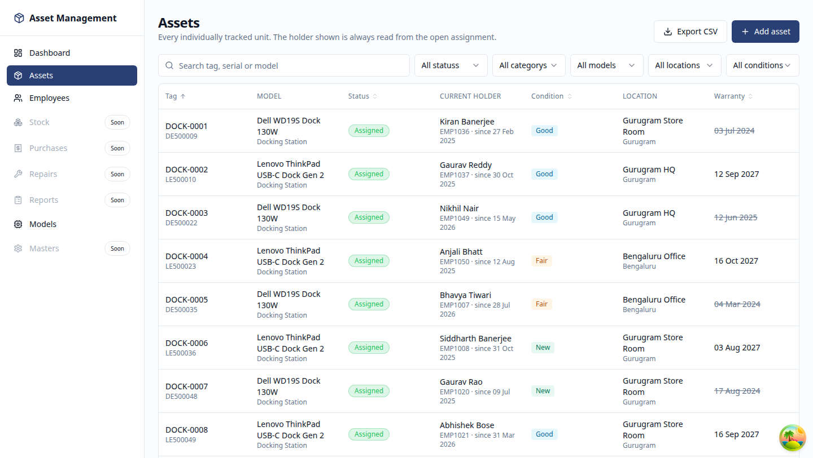
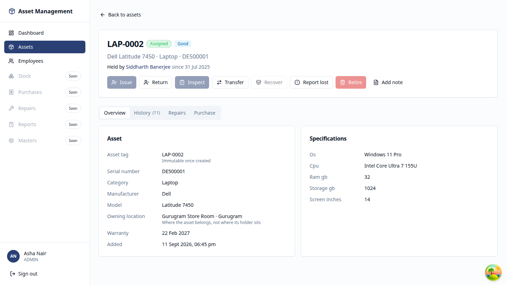
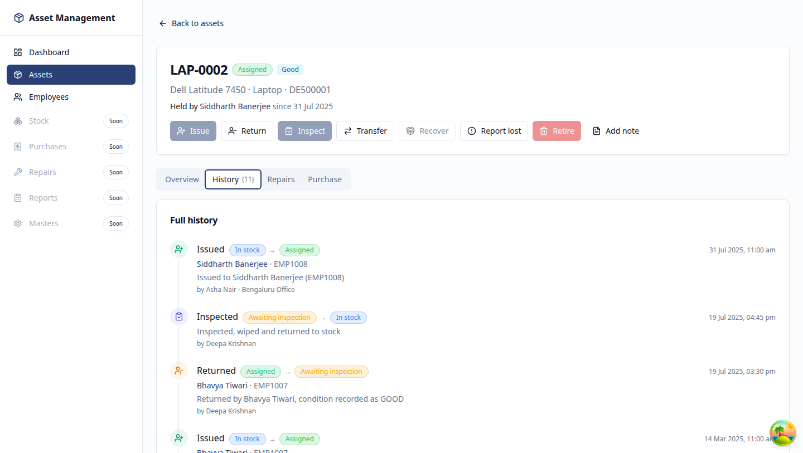
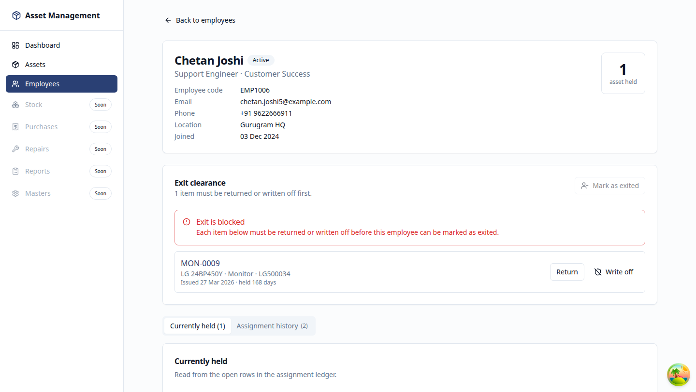
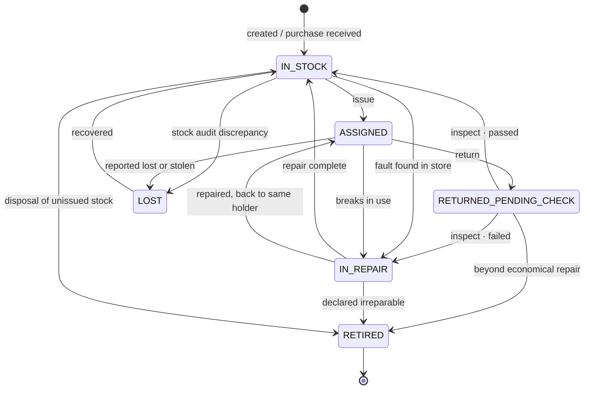

# IT Asset Management

An internal system for tracking the hardware a company hands to its people —
laptops, monitors, chargers, docks, headsets. It answers, for any moment past
or present: **who holds this, what does this person hold, and what has happened
to it since we bought it.**

Built as a monorepo: NestJS + Prisma + PostgreSQL on the back, React + Vite on
the front, with a shared package holding the contract between them.

| | |
|---|---|
| **Phases complete** | 3 of 8 |
| **Tests** | 223 passing (121 unit, 102 integration) |
| **Database tables** | 10 |
| **API endpoints** | 40 |
| **Demo fixture** | 200 assets · 60 employees · 120 assignments · 452 events |

📖 **[Read the handbook](https://claude.ai/code/artifact/a1a5090a-ae21-43c7-b29a-3d36914322c5)** — a
plain-language walkthrough of the design, with diagrams.
🎬 **[Demo walkthrough](./docs/DEMO.md)** — a step-by-step script for showing it to someone.

---



## The problem it solves

Six months after a laptop is handed over, somebody asks a question that sounds
simple and usually isn't: *who had this in March?*

Most systems answer it badly, because they store the current holder as a column
on the asset. The moment that laptop moves from Priya to Bob, you overwrite the
column — and Priya is gone. Not archived, **gone**. Answering "who has it now"
destroyed the answer to "who had it then".

So this system never stores the holder. It derives it.

There is a separate `assignment` table with one row per *"this person held this
asset, from this date, in this condition"*. The current holder is whoever sits
on the single row still marked `OPEN`. Handing hardware on doesn't overwrite
anything — it closes one row and opens another.

Everything else follows from that. Employees are never deleted, only marked
`EXITED`, because deleting one would orphan every assignment pointing at them.
The event log is append-only, because an editable history isn't a history.
Retired assets stay in the database forever.

**The system's job is to not forget things, so nothing in it is allowed to forget.**

## What's built

| Phase | Scope | State |
|---|---|---|
| 1 | Monorepo, Docker, schema, migrations, seed, auth with roles, error envelope, logging | ✅ Done |
| 2 | State machine, issue / return / inspect / transfer / mark-lost, asset list & detail, event timeline, employee list & detail | ✅ Done |
| 3 | Exit clearance checklist, write-off flow, the rule blocking an exit while someone still holds something | ✅ Done |
| 4 | Purchases, line items, receiving into inventory, invoice upload | ⬜ Next |
| 5 | Bulk stock balances, movement ledger, reorder alerts, reconciliation | ⬜ |
| 6 | Repair tickets, warranty auto-detection, cost tracking | ⬜ |
| 7 | Reports, CSV/XLSX exports, barcode labels, scheduled alerts | ⬜ |
| 8 | Dockerfiles, GitHub Actions CI, deployment docs | ⬜ |

Navigation entries for unbuilt screens are shown greyed out rather than hidden,
so the shape of the finished system stays visible.

## The screens

### Assets — filter, search, sort, export

Every individually tracked unit. The holder column is read from the open
assignment row, never from the asset itself. Filters live in the URL, so a
filtered view is a shareable link.



### Asset detail — actions that respect the state machine

Action buttons derive from the same transition table the API enforces. On an
assigned laptop, *Issue* is disabled with a tooltip explaining why, rather than
failing after you click it.



### History — the full event timeline

Every issue, return, inspection, repair and transfer, newest first, with the
status change, who did it and who it involved. This is the most-used read in
the system, and the reason it exists.



### Employee detail — holdings, history and exit clearance

What they hold now, everything they've ever held, and a clearance panel that
refuses to let them be marked as exited while anything is outstanding. Each
blocking item can be returned or written off from here.



## How an asset moves

Six statuses, fifteen legal transitions, one service allowed to apply them.
Anything not on the allow-list is rejected with a `422` before it touches the
database.



The gap that matters: **there is no arrow from ASSIGNED straight to IN_STOCK.**
A returned laptop always lands in `RETURNED_PENDING_CHECK` and stays there until
someone explicitly inspects it. That step is deliberate — the alternative is
somebody being issued a laptop with a cracked screen and the last employee's
data still on the disk.

## Guarantees enforced by PostgreSQL, not by application code

Application checks produce good error messages and catch honest mistakes. What
they cannot do is survive a race condition, a bug, or someone with a `psql`
prompt. So the rules that genuinely must not break live in the database:

| Attempted write | Refused by |
|---|---|
| A second `OPEN` assignment on one asset | `assignment_one_open_per_asset` (partial unique index) |
| `UPDATE` on `asset_event` | `asset_event_no_update` (trigger) |
| `DELETE` on `asset_event` | `asset_event_no_delete` (trigger) |
| An `EXITED` employee with no exit date | `employee_exited_has_date` (check constraint) |
| An `OPEN` assignment carrying a close date | `assignment_closed_has_closed_on` |
| A return date with no condition recorded | `assignment_returned_has_condition_in` |
| A `BULK` category demanding serial numbers | `asset_category_bulk_needs_no_serial` |
| Deleting an employee or asset with history | Foreign keys, `ON DELETE RESTRICT` |

The first one is load-bearing: two concurrent issue requests can *both* pass an
application-level `SELECT` check and both try to insert. The partial unique
index makes the loser fail at the database, and the API turns that specific
failure into a clean `409` rather than a 500. There is an integration test that
fires both requests genuinely in parallel and asserts exactly one wins.

## Tech

| Layer | Choice |
|---|---|
| **Backend** | Node 20 · NestJS 10 · TypeScript strict · Prisma 6 · PostgreSQL 16 |
| **Validation** | Zod schemas shared between API and web via `nestjs-zod` |
| **Auth** | argon2id passwords · 15-min JWT access tokens · rotating 7-day refresh tokens stored as SHA-256 digests |
| **Frontend** | React 18 · Vite · TailwindCSS · shadcn/ui · TanStack Query & Table · React Hook Form · Recharts |
| **Testing** | Vitest · Supertest · integration tests against a real Postgres container |
| **Infra** | Docker Compose (Postgres, Redis, MinIO) |

`packages/shared` is the single source of truth for every request and response
shape. The API validates against those schemas; the web app validates its forms
against the same ones and infers its types from them. Rename a field and both
sides break in the same compile — the contract can't drift.

## Quick start

Requires **Node 20**, **pnpm 9** and **Docker**.

```bash
nvm use                 # reads .nvmrc
cp .env.example .env    # defaults work as-is
docker compose up -d    # Postgres, Redis, MinIO (bucket auto-created)
pnpm install
pnpm db:migrate
pnpm db:seed
pnpm dev
```

Open **http://localhost:5173** and sign in.

| Account | Password | Role |
|---|---|---|
| `admin@example.com` | `Admin@12345` | ADMIN — everything |
| `storekeeper@example.com` | `Admin@12345` | STORE_KEEPER — issue, return, inspect, transfer |
| `viewer@example.com` | `Admin@12345` | VIEWER — read-only |

| Service | URL |
|---|---|
| Web | http://localhost:5173 |
| API | http://localhost:3000/api/v1 |
| Swagger | http://localhost:3000/api/docs |
| MinIO console | http://localhost:9011 (`minioadmin` / `minioadmin`) |

### Ports

This project avoids the default ports, because they're commonly taken by other
local stacks: Postgres **5442**, test Postgres **5443**, Redis **6389**, MinIO
**9010/9011**. Change them in `.env` — `docker-compose.yml` reads the same values.

## Commands

```bash
pnpm dev                 # API and web together
pnpm build               # build every package
pnpm typecheck           # source and tests
pnpm lint
pnpm test                # unit tests

pnpm --filter @asset/api test:integration   # needs docker compose up
pnpm --filter @asset/api test:all

pnpm db:migrate          # create and apply a migration
pnpm db:migrate:deploy   # apply pending migrations (CI / production)
pnpm db:reset            # drop, re-migrate, re-seed
pnpm db:studio

pnpm infra:up / infra:down / infra:reset
```

## Tests

```
223 passing
├── 121 unit         pure, no database, run in ~1s
└── 102 integration  against a real PostgreSQL 16 container
```

The state machine suite covers **all 42 status pairs** — every legal transition
and every illegal one — not a sample. Integration tests run against the same SQL
production gets, applied with `migrate deploy`, so the partial index and the
append-only triggers are genuinely exercised rather than mocked away.

They share one database and truncate between tests, so they run single-process
on purpose (`--no-file-parallelism`).

### Migrations

Checked-in migrations are never edited after being applied — fix forward with a
new one.

> **⚠️ Read every generated migration before applying it.** Prisma's schema
> language can't express partial indexes or triggers, so those were hand-written
> into the initial migration. Prisma doesn't know they exist, and
> `prisma migrate dev` may propose dropping them as drift.

## Deployment

Deployed free across three providers — see the
[handbook](https://claude.ai/code/artifact/a1a5090a-ae21-43c7-b29a-3d36914322c5)
for the step-by-step.

| Piece | Provider | Note |
|---|---|---|
| Frontend | **Vercel** | `vercel.json` handles the monorepo build and SPA rewrites |
| API | **Render** | `render.yaml` is a Blueprint — builds, generates the Prisma client, migrates, then boots |
| Database | **Neon** | Serverless Postgres. *Not* Render's free Postgres, which is deleted after 30 days |

The API reads whatever `PORT` the host injects, and `CORS_ORIGINS` accepts a
wildcard suffix like `*.vercel.app` so preview deploys work without listing each
generated URL.

## Where to look in the code

| If you want to understand… | Read |
|---|---|
| The transition rules | `packages/shared/src/state-machine.ts` |
| The only thing that writes `asset.status` | `apps/api/src/common/state-machine/asset-state-machine.service.ts` |
| Every business rule from the spec | `apps/api/src/modules/assets/assets.service.ts` |
| How the holder is derived, never stored | `apps/api/src/modules/assets/assets.repository.ts` |
| The database-level guarantees | `apps/api/prisma/migrations/*/migration.sql` (bottom of the file) |
| The demo fixture | `apps/api/prisma/seed.ts` |

## Out of scope, deliberately

No employee self-service portal, no approval workflows, no procurement request
flows, no depreciation or accounting integration, no mobile app, no
multi-tenancy, no realtime websockets. The users are the IT team, and only the
IT team — employees are records in this system, not users of it. That single
decision removes about half the software you'd otherwise write.
